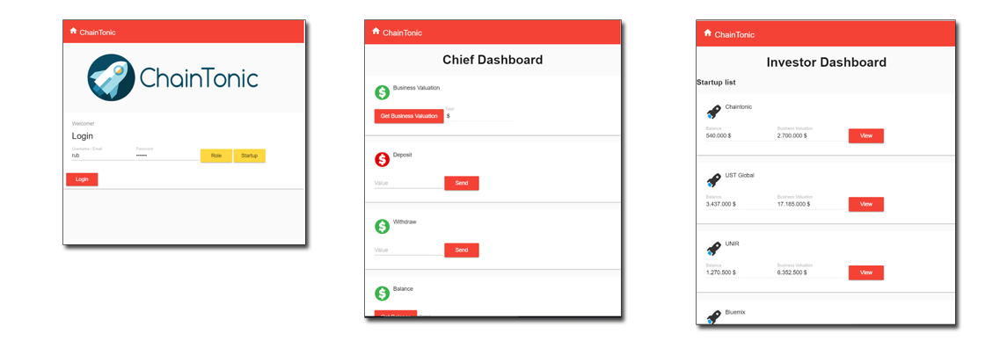
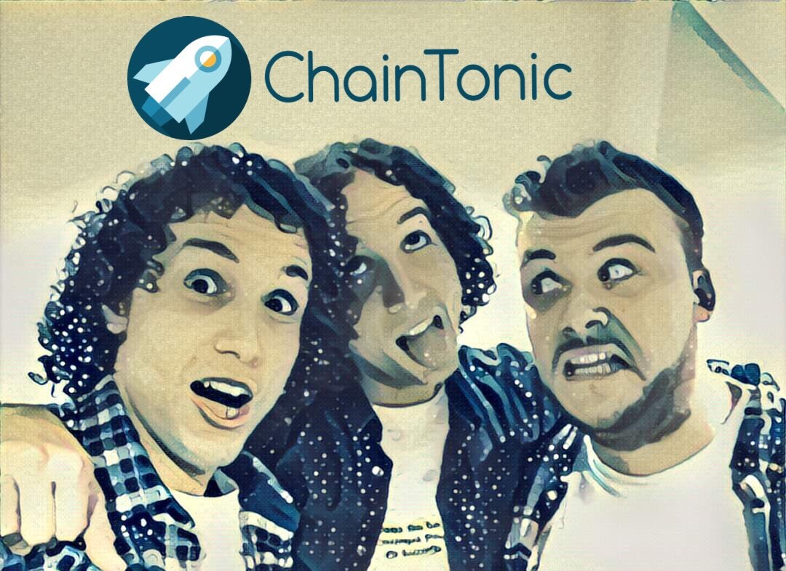

# ChainTonic

Prototipo de una Plataforma construida sobre SmartContract con tecnologías BlockChain, con el objetivo de servir de base para las operaciones imprescindibles de las StartUp.
Esto permitira la construcción de una nueva generación de Startup nativas en el Blockchain, preparadas para sacar todo el partido a este nuevo ecosistema. 

La idea es aprobechar la características de Seguridad, Inmutabilidad y transparencia de la plataforma Blockchain para exponer la actividad de la Startup y potenciar su posibilidades en tres lineas complementarias:
 * Control de las Operaciones: Que todos los miembros de la empresa e interesados en su actividad podrías acceder de forma segura y controlada.
 * Visualización del Estado de la Startup: Habiliad de por consultar la salud de la Startup para el CEO, los miembros de la junta de administración, etc.   
 * Valoración de Startups: Inversores pueden visualizar en base a un sistema transparente de valoración una lista con diferentes Startups.  

## Tecnologías empleadas:

* **Eris Framework y Solidity:** Para la implementación de Smart Contracts, el core de la aplicación, con el que hemos desarrollado la lógica de negocio de la aplicación.  
* **NodeJS desplegado sobre Bluemix (IBM Cloud):** Middleware sobre el que construimos la API que expusimos al FrontEnd y a través del cual nos comunicamos con Eris.  
* **Angular2:** Utilizamos la ultima versión del framework, para la implementacion de un frontEnd ágil e interactivo.

## Capturas de la aplicación

## Slides

Podeis encontrar las slides del proyecto en el siguiente link:
* [Team 6 - ChainTonic Slides](docs/ChainTonic.pdf)

## Miembros del Equipo

* Jose Manuel Bermudo [@josh2code](https://twitter.com/josh2code)
* Ruben Chavarri Eldauyen [@pekewake](https://twitter.com/pekewake)
* David Chavarri Elduayen [@dvdchavarri](https://twitter.com/dvdchavarri)

**Muchas gracias al equipo de UST Global y a todos los patrocinadores del evento, que lo han hecho posible.**
